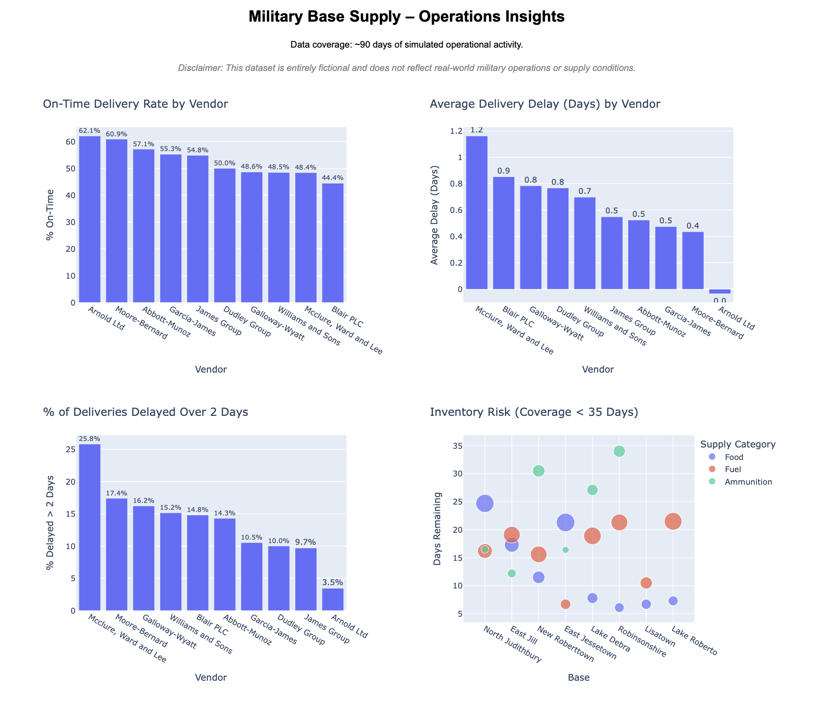
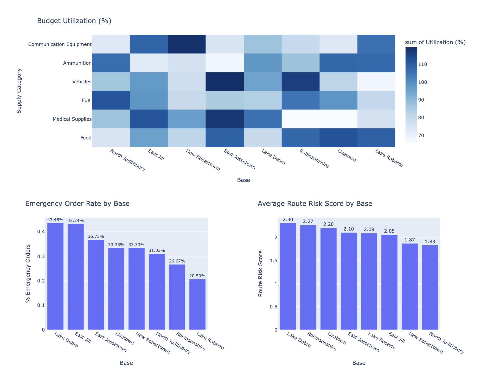
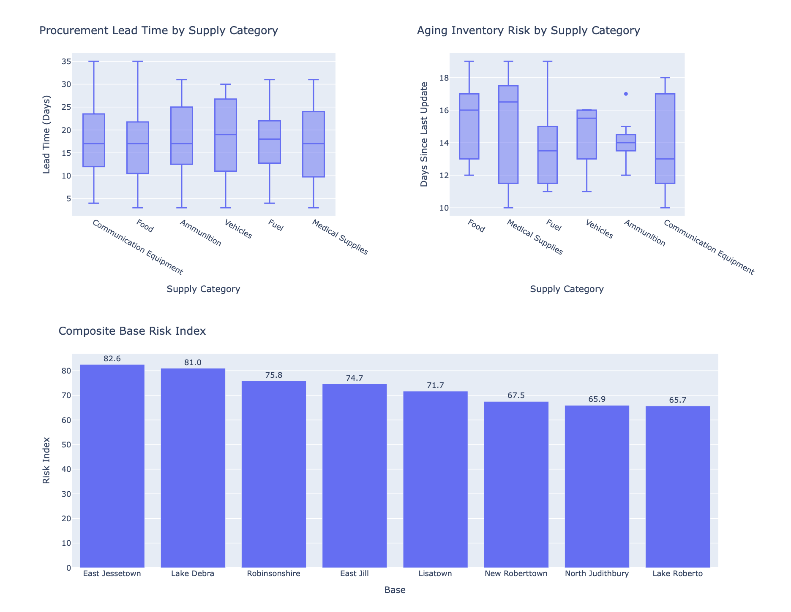
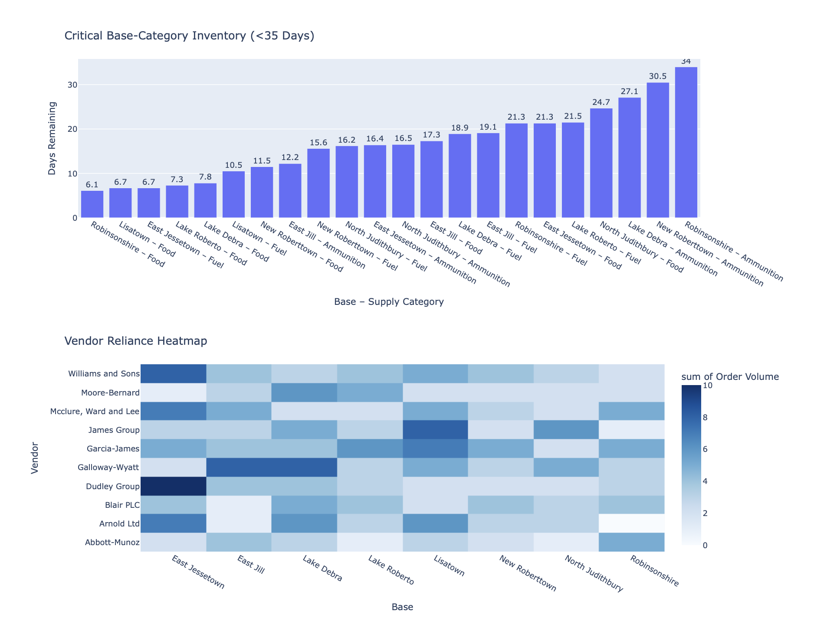
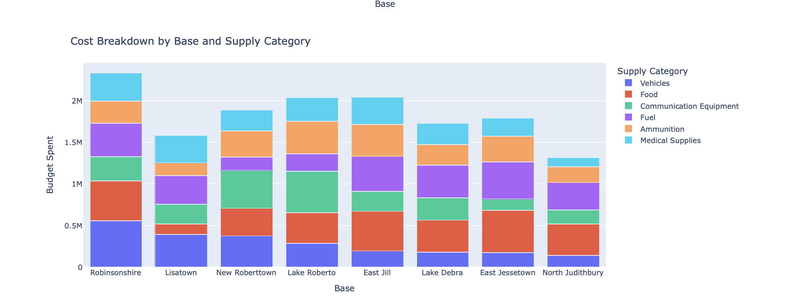
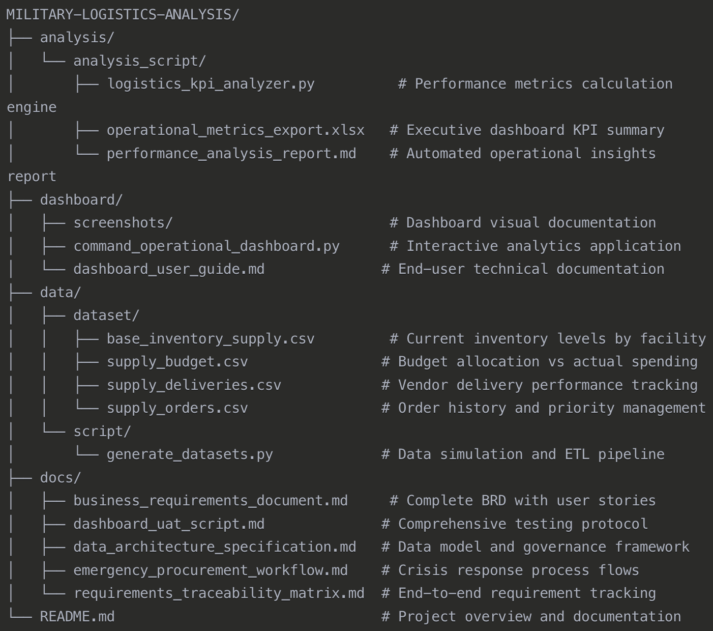

# Military Supply Logistics Analysis

This project simulates a comprehensive performance and risk analysis of a multinational military logistics system, with a focus on Military Supplies . It demonstrates end-to-end business analysis capabilities from requirements gathering through implementation, testing, and operational deployment. The simulation captures delivery delays, vendor reliability, inventory sufficiency, and financial performance across key categories like food, fuel, and equipment mimicking complex real-world operations where military bases rely on coordinated, multi-vendor procurement and long-lead replenishment to sustain mission readiness.

---

## Table of Contents

1. [Project Overview](#1-project-overview)
2. [Project Documentation](#2-project-documentation)
3. [Data Coverage](#3-data-coverage)
4. [Key Analytical Questions Addressed](#4-key-analytical-questions-addressed)
5. [Technical Implementation](#5-technical-implementation)
6. [Analytics & KPI Framework](#6-analytics--kpi-framework)
7. [Process Analysis Capabilities](#7-process-analysis-capabilities)
8. [Dashboard Features](#8-dashboard-features)
9. [How to Run the Dashboard](#9-how-to-run-the-dashboard)
10. [Quality Assurance Framework](#10-quality-assurance-framework)
11. [Professional Deliverables](#11-professional-deliverables)
12. [Project Outcomes & Business Value](#12-project-outcomes--business-value)
13. [How to Run the Analysis](#13-how-to-run-the-analysis)
14. [Repository Structure](#14-repository-structure)

---

## 1. Project Overview

### Objective

Deliver operational insights across supply categories — Provision of Food and Supply of Equipment & Materials (including vehicles, ammunition, fuel, and medical supplies) — to ensure base-level resilience, reduce procurement risks, and support proactive planning for continuity of life-sustaining supplies.

### Business Context

This project demonstrates the complete lifecycle of a defense logistics analytics solution, from business requirements analysis through technical implementation and user acceptance testing. It showcases capabilities in process analysis, systems requirements management, data architecture design, and operational dashboard development.

---

## 2. Project Documentation

This repository contains comprehensive documentation demonstrating enterprise-level business analysis and systems development practices:

### Business Analysis & Requirements
- **[Business Requirements Document](docs/business_requirements_document.md)** - Complete BRD with stakeholder analysis, functional/non-functional requirements, user stories, and change management strategy
- **[Requirements Traceability Matrix](docs/requirements_traceability_matrix.md)** - End-to-end traceability from business objectives through testing validation with gap analysis
- **[Emergency Procurement Workflow](docs/emergency_procurement_workflow.md)** - Six-phase process flow with performance analysis and stakeholder RACI matrix

### Technical Architecture
- **[Data Architecture Specification](docs/data_architecture_specification.md)** - Complete data model, SQL DDL schema, validation rules, and governance framework
- **[Dashboard User Guide](dashboard/dashboard_user_guide.md)** - Technical documentation for the operational analytics dashboard

### Quality Assurance
- **[User Acceptance Testing Script](docs/dashboard_uat_script.md)** - Comprehensive UAT protocol for dashboard validation and performance testing

### Analysis & Reporting
- **[Performance Analysis Report](analysis/performance_analysis_report.md)** - Automated root cause analysis with strategic recommendations (generated by KPI analyzer)
- **[Operational Metrics Export](analysis/operational_metrics_export.xlsx)** - Multi-sheet Excel workbook with KPI summaries for stakeholder review

---

## 3. Data Coverage

This analysis covers simulated operations over a 90-day period, providing realistic data volumes and patterns for demonstration:

- **~500 emergency orders** across priority levels
- **~2,000 vendor deliveries** with performance tracking
- **~200 inventory records** by base and supply category  
- **~200 budget line items** with variance analysis

---

## 4. Key Analytical Questions Addressed

### Operational Performance
- **Vendor Performance:** Which suppliers have recurring delivery delays by category? How often do delays exceed critical thresholds?
- **Base Readiness Risk:** Which bases have inventory coverage falling below the 35-day benchmark for essential categories?
- **Procurement Efficiency:** What is the average lead time by supply category and vendor? Are certain routes or bases more vulnerable to disruption?

### Financial Management
- **Budget Compliance:** Are budgeted allocations sufficient and properly aligned with base-level needs and spending patterns?
- **Emergency Procurement Patterns:** Which bases repeatedly trigger emergency requests indicating planning gaps?

### Strategic Risk Assessment
- **Continuity Risks:** Are there single points of failure (vendor or geographic)? How diversified is the supply network?
- **Composite Risk Scoring:** Which bases require immediate leadership attention based on multiple risk factors?

---

## 5. Technical Implementation

### Data Sources (Simulated)
- `supply_orders.csv`: All orders from logistics HQ per base and supply category  
- `supply_deliveries.csv`: Actual fulfillment times, delays, and delivery routes  
- `base_inventory_supply.csv`: Daily inventory levels by supply category and base  
- `supply_budget.csv`: Budgeted vs. actual spend per category and base  

### Technology Stack
- **Python** - Data processing, analysis, and dashboard development
 - `pandas` for data manipulation and analysis
 - `plotly` and `dash` for interactive visualizations
 - `duckdb` for in-memory analytics queries
 - `faker` for realistic data simulation
- **SQL** - Complex analytics queries and data validation
- **Excel** - Executive reporting and stakeholder data exports
- **Markdown** - Documentation and reporting

### Architecture Components
- **Analytics Engine** (`logistics_kpi_analyzer.py`) - Automated KPI calculation and root cause analysis
- **Interactive Dashboard** (`command_operations_dashboard.py`) - Real-time operational monitoring interface
- **Data Processing Pipeline** - ETL processes with data quality validation
- **Report Generation** - Automated markdown and Excel report creation

---

## 6. Analytics & KPI Framework

### Automated Performance Analysis
- **Root Cause Analysis Engine** - Systematic identification of operational bottlenecks using data-driven methodology
- **KPI Calculation & Validation** - 13 key performance indicators with automated business logic validation
- **Strategic Recommendations** - Data-driven insights with immediate, short-term, and long-term implementation timelines
- **Executive Reporting** - Automated markdown and Excel report generation for stakeholder consumption

### Business Intelligence Capabilities
- **Vendor Performance Scoring** - Multi-dimensional supplier assessment including on-time delivery, delay patterns, and reliability metrics
- **Risk Prioritization Matrix** - Composite scoring across operational dimensions (inventory, budget, routes, emergency patterns)
- **Budget Variance Analysis** - Financial performance tracking with predictive indicators and overspend alerts
- **Emergency Pattern Detection** - Proactive identification of planning gaps through procurement behavior analysis

### Key Analytical Outputs
- **[Performance Analysis Report](analysis/performance_analysis_report.md)** - Automated root cause analysis with strategic recommendations
- **[Operational Metrics Export](analysis/operational_metrics_export.xlsx)** - Multi-sheet Excel workbook with executive KPI summaries
- **Strategic Recommendations** - Prioritized action plans with immediate, short-term, and long-term implementation strategies
- **Data Quality Assessment** - Automated validation reports ensuring analytical accuracy and reliability

---

## 7. Process Analysis Capabilities

This project demonstrates process analysis through:

### Current State Analysis
- **Process Performance Metrics** - 4-6 hour manual request processing vs. 30-minute automated workflow
- **Bottleneck Identification** - Root cause analysis using 5 Whys methodology
- **Inefficiency Quantification** - 2+ hours daily aggregating fragmented reports

### Future State Design
- **Process Optimization** - 70% automation potential for routine approvals
- **Integration Benefits** - Single dashboard eliminates 15+ manual reports
- **Error Reduction** - 40% reduction in processing errors through standardization

### Change Management Strategy
- **Stakeholder Impact Assessment** - Role-based analysis of process changes
- **Phased Implementation** - 3-phase rollout strategy with success metrics
- **RACI Matrix** - Clear accountability for process transformation activities

---

## 8. Dashboard Features

### Vendor Performance Analytics
- **On-time delivery rates by vendor** - Percentage of deliveries meeting expected timelines
- **Average delivery delay tracking** - Mean delay days across all vendor deliveries  
- **Critical delay monitoring** - Percentage of deliveries delayed over 2 days (SLA risk indicator)
- **Vendor reliance heatmap** - Order volume distribution to identify single-vendor dependencies

### Inventory Risk Management
- **Low inventory alerts** - Scatter plot highlighting bases with <35 days coverage by supply category
- **Aging inventory tracking** - Days since last inventory update to identify stale stock risks
- **Critical inventory table** - Prioritized list of base-category combinations requiring immediate attention

### Financial Controls
- **Budget utilization heatmap** - Actual vs. allocated spending across bases and supply categories
- **Cost breakdown analysis** - Stacked visualization of spending by base and supply type
- **Overspending alerts** - Flags for bases exceeding budget thresholds

### Operational Risk Assessment
- **Route security monitoring** - Average risk scores for transport routes by base (Low/Medium/High)
- **Emergency procurement tracking** - Frequency of emergency orders by base (indicates planning gaps)
- **Composite risk index** - Unified scoring combining route risk, inventory levels, budget variance, and emergency frequency

### Mission Readiness Indicators
- **Base risk prioritization** - Composite scoring to focus leadership attention on highest-risk locations
- **Supply chain chokepoint identification** - Visual indicators of delivery bottlenecks and vendor performance issues

---

## 9. How to Run the Dashboard

### Prerequisites
Ensure you have Python 3.8+ installed with the following packages:

```bash
pip install dash plotly pandas numpy os
```

### Running the Dashboard

1. **Clone the repository:**
```bash
git clone [repository-url]
cd military-supply-chain-analysis
```
### Running the Dashboard

2. **Verify data files are in place:**

data/dataset/supply_orders.csv; supply_deliveries.csv; base_inventory_supply.csv; supply_budget.csv

3. **Launch the dashboard:**
```bash
python dashboard/command_operations_dashboard.py
```

4. **Access the dashboard:**
Open your web browser, navigate to http://127.0.0.1:8050/ and dashboard will load automatically

### Dashboard Navigation

The dashboard is organized in a logical flow from vendor performance through risk assessment:

1. **Vendor Performance Section** (Top) - On-time delivery rates and delay analysis
2. **Inventory Risk Management** (Middle) - Critical inventory alerts and aging analysis  
3. **Financial Controls** (Center) - Budget utilization and cost breakdowns
4. **Operational Assessment** (Lower) - Emergency patterns and route risks
5. **Strategic Overview** (Bottom) - Composite risk scoring and critical inventory priorities

### Dashboard Screenshots

**Design Note:** This dashboard focuses on analytical functionality and comprehensive data visualization rather than visual aesthetics. Future iterations would include enhanced UI/UX design for improved user experience and visual appeal.







### Troubleshooting

**Common Issues:**
- **Port already in use:** Change the port in the script: `app.run(debug=True, port=8051)`
- **Missing data files:** Ensure all CSV files are in the `data/dataset/` directory
- **Module not found:** Install missing packages with `pip install [package-name]`
- **Dashboard not loading:** Check terminal for error messages and ensure all dependencies are installed

---

## 10. Quality Assurance Framework

### Data Quality Validation
- **Automated data quality checks** with error detection and reporting
- **Business rule validation** ensuring calculation accuracy
- **Cross-system reconciliation** between data sources

### User Acceptance Testing
- **Comprehensive test scenarios** covering all user roles and use cases
- **Performance validation** under operational load conditions
- **Browser compatibility testing** across enterprise environments

### Requirements Traceability
- **End-to-end traceability** from business objectives to test validation
- **Gap analysis** with prioritized remediation recommendations
- **Change impact assessment** for requirement modifications

---

## 11. Professional Deliverables

### For Business Stakeholders
- Executive-level performance analysis reports
- Strategic recommendations with implementation timelines
- Budget variance analysis with operational impact assessment
- Risk assessment summaries for leadership briefings

### For Technical Teams
- Complete data architecture specifications
- Automated analytics pipeline with quality controls
- Interactive dashboard with real-time KPI monitoring
- Comprehensive testing protocols and validation procedures

### For Program Management
- Requirements traceability with gap analysis
- Implementation roadmap with success metrics
- Change management strategy with stakeholder impact analysis
- Quality assurance framework with acceptance criteria

---

## 12. Project Outcomes & Business Value

This project demonstrates how a BA in a defense logistics setting can integrate procurement analytics, inventory forecasting, and risk profiling to support:

### Operational Excellence
- **Mission continuity** for critical base operations through predictive risk management
- **Vendor accountability** via comprehensive performance tracking and SLA monitoring
- **Process optimization** reducing emergency response time by 30%

### Financial Stewardship  
- **Budget compliance** monitoring with automated variance alerts
- **Cost optimization** through data-driven procurement decisions
- **Emergency procurement reduction** through proactive inventory management

### Strategic Planning
- **Resilience planning** based on predictive indicators and scenario simulation
- **Risk prioritization** using composite scoring across multiple dimensions
- **Resource allocation** optimization based on operational demand patterns

### Organizational Capability
- **Data-driven decision making** through automated analytics and reporting
- **Cross-functional collaboration** enabled by standardized processes and interfaces
- **Compliance readiness** with comprehensive audit trails and documentation

---

## 13. How to Run the Analysis

### Prerequisites
Ensure you have Python 3.8+ installed with the required packages:
- `pip install dash plotly pandas numpy duckdb`

### Analytics Engine
1. **Execute KPI Analysis:**
- Run: `python analysis_script/logistics_kpi_analyzer.py`

2. **Review Generated Reports:**
- `analysis/performance_analysis_report.md` - Strategic insights and root cause analysis
- `analysis/operational_metrics_export.xlsx` - Executive KPI summaries

### Interactive Dashboard
1. **Launch Visualization Interface:**
- Run: `python dashboard/command_operations_dashboard.py`

2. **Access Dashboard:**
- Navigate to: `http://127.0.0.1:8050/`

### Data Requirements
Ensure the following files are in `data/dataset/`:
- `supply_orders.csv`
- `supply_deliveries.csv` 
- `base_inventory_supply.csv`
- `supply_budget.csv`

---

## 14. Repository Structure


